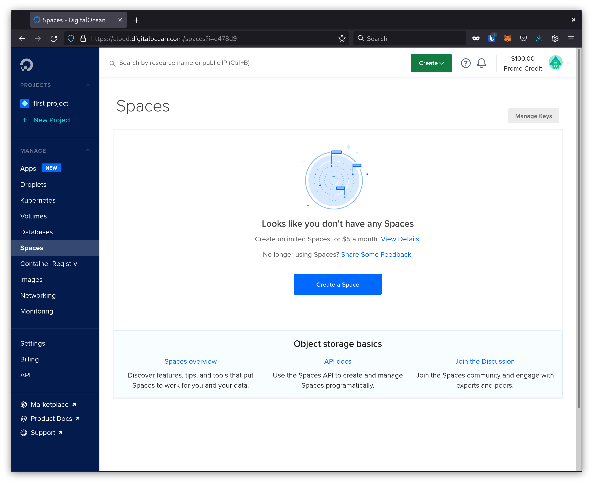
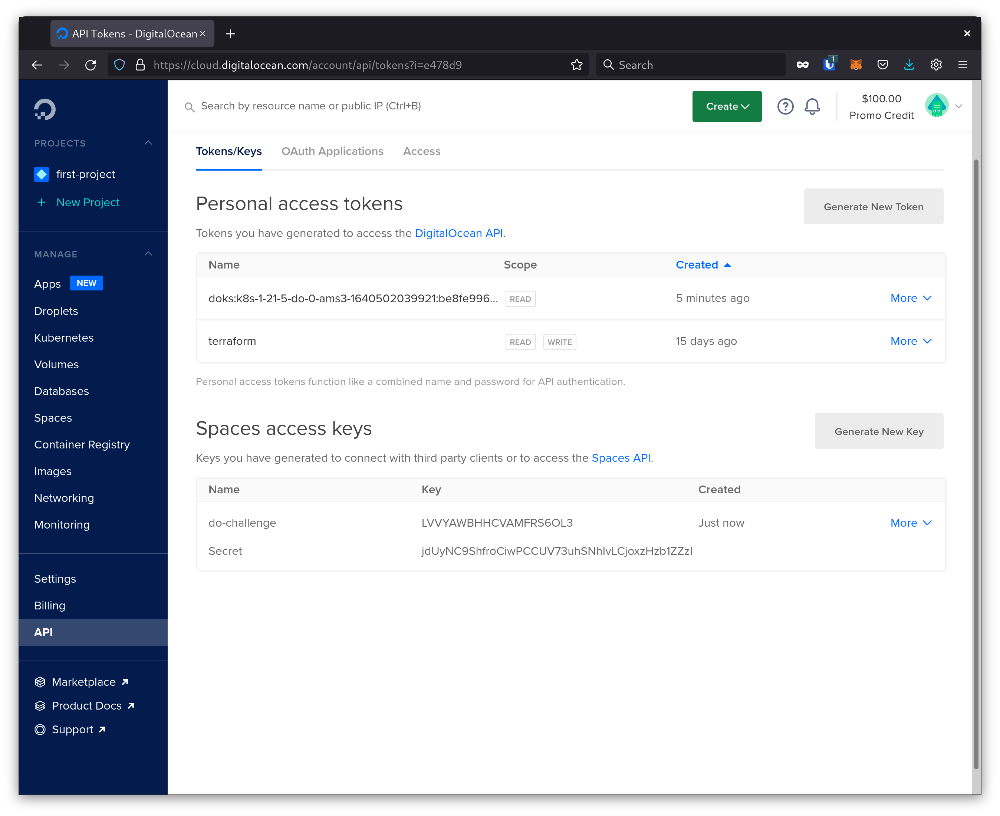

# Digital Ocean Kubernetes Challenge

## Goal

Deploy a Kubernetes Cluster on Digital Ocean, deploy a Docker Registry using Digital Ocean Object storage as storage backend,
then expose it without using a Load Balancer; using a subproject borned from this challenge: [k8s-tunnel-controller](https://github.com/angelbarrera92/k8s-tunnel-controller/)

## Hands on!

### Create a Kubernetes Cluster

Navigate to your [Digital Ocean account](https://cloud.digitalocean.com).


Then, navigate to the [Kubernetes page](https://cloud.digitalocean.com/kubernetes).):


And create a new cluster making sure to select:
- At least two node in the default node pool.
- The basic node plan.


**NOTE:** *(It will cost around 20$ per month)*

Wait a few minutes to be able to access the cluster. It can take up to five minutes to be ready.


Then, download the Kube config file, and save it in your home directory: `~/.kube/config`.

```bash
$ mv ~/Downloads/k8s-1-21-5-do-0-ams3-1640502039921-kubeconfig.yaml ~/.kube/config
```

Check the cluster status:

```bash
$ kubectl get nodes
NAME                   STATUS   ROLES    AGE     VERSION
pool-pzl0cpssp-u63sf   Ready    <none>   5m27s   v1.21.5
pool-pzl0cpssp-u63sq   Ready    <none>   5m27s   v1.21.5
```

### Create the required bucket and credentials

In order to provide distributed and fault tolerant storage, Digital Ocean provides a service called Spaces *(S3 compatible)*.
The registry will use Spaces to store the container images.

Navigate to the Spaces page:



Then, create a new bucket:


It is important to select the same region as the cluster, it will increase the performance/latency of the storage.

Finally, create a set of API keys for the bucket navigating to the API page:


Then create a new key:



**NOTE:** *Credentials in the screenshot are not longer valid, just for your information.*

### Deploy the K8S-tunnel-controller

[K8S-tunnel-controller](https://github.com/angelbarrera92/k8s-tunnel-controller) is a subproject borned from this challenge.
It allows to expose a Kubernetes internal service to internet with automatic TLS, custom DNS, and
without exposing any node of the cluster to internet.

In order to deploy it, the easiest way is to use the `kubectl` command with the following URL.

```bash
$ kubectl apply -f https://raw.githubusercontent.com/angelbarrera92/k8s-tunnel-controller/v0.1.0/deployments/kubernetes/manifests/deploy.yaml
serviceaccount/tunnels-k8s-tunnel-controller created
clusterrole.rbac.authorization.k8s.io/tunnels-k8s-tunnel-controller created
clusterrolebinding.rbac.authorization.k8s.io/tunnels-k8s-tunnel-controller created
service/tunnels-k8s-tunnel-controller created
deployment.apps/tunnels-k8s-tunnel-controller created
pod/tunnels-k8s-tunnel-controller-test-connection created
```

After a while, you will see the following output:

```bash
$ kubectl get pods
NAME                                             READY   STATUS    RESTARTS   AGE
tunnels-k8s-tunnel-controller-846f94c6c9-s7s2r   1/1     Running   0          3m46s
tunnels-k8s-tunnel-controller-test-connection    0/1     Error     0          3m46s
```

> Don't worry about the `test-connection` pod, it will be automatically deleted after a while.

### Prepare the registry configuration

Create a configuration file for the registry from [this template](config-template.yml)
```yaml
---
version: 0.1
log:
  level: debug
  formatter: text
  fields:
    service: registry
loglevel: debug
storage:
  redirect:
    disable: true
  s3:
    accesskey: <YOUR_ACCESS_KEY>
    secretkey: <YOUR_SECRET_KEY>
    region: <YOUR_REGION>
    regionendpoint: <YOUR_REGION_ENDPOINT>
    bucket: <YOUR_BUCKET>
http:
  addr: :5000
  # cat /dev/urandom | tr -dc 'a-z0-9' | fold -w 32 | head -n 1
  secret: <RANDOM_SECRET_GOES_HERE>
  headers:
    X-Content-Type-Options: [nosniff]
  http2:
    disabled: false
  host: https://<YOUR_TUNNEL>.tunnels.o.barrera.dev
auth:
  htpasswd:
    realm: basic-realm
    path: /auth/htpasswd
```

It contains the following configuration:

- `YOUR_ACCESS_KEY`: The access key for the bucket.
- `YOUR_SECRET_KEY`: The secret key for the bucket.
- `YOUR_REGION`: The region of the bucket.
- `YOUR_REGION_ENDPOINT`: The region endpoint of the bucket.
- `YOUR_BUCKET`: The bucket name.
- `RANDOM_SECRET_GOES_HERE`: A random secret to be used for the endpoint.
  - Feel free to use `cat /dev/urandom | tr -dc 'a-z0-9' | fold -w 32 | head -n 1` command to generate it.
- `YOUR_TUNNEL`: The name of the tunnel.

Then, create a secret for the registry. It will be used to authenticate the registry.
The secret will be created with the following command:

```bash
$ kubectl create namespace registry
namespace/registry created
$ kubectl create secret generic -n registry registry-auth --from-literal=username=<REGISTRY_USERNAME> --from-literal=password=<REGISTRY_PASSWORD> --dry-run -o yaml | kubectl apply -f -
W1226 10:18:23.382124   70151 helpers.go:557] --dry-run is deprecated and can be replaced with --dry-run=client.
secret/registry-auth created
```

It contains the following configuration:

- `REGISTRY_USERNAME`: The username for the registry.
- `REGISTRY_PASSWORD`: The password for the registry.


Once you have in place all the configuration, you can deploy the registry.

### Deploy the registry

```bash
$ kubectl create secret generic registry -n registry --from-file=config.yml=config.yml --dry-run -o yaml | kubectl apply -f -
W1226 09:04:15.766940  166192 helpers.go:557] --dry-run is deprecated and can be replaced with --dry-run=client.
secret/registry created
$ kubectl apply -f registry.yaml
daemonset.apps/registry created
service/registry created
$ kubectl get pods -n registry
NAME             READY   STATUS    RESTARTS   AGE
registry-d4mkj   1/1     Running   0          5s
registry-lt68f   1/1     Running   0          5s
```

### Expose the registry

Then annotate your registry service to expose it to the internet using the `<YOUR_TUNNEL>` name. In this case: `registry-do-challeng`.

```bash
$ kubectl annotate service registry -n registry k8s-tunnel-controller/tunnel=registry-do-challenge
service/registry annotated
$ kubectl get pods -n registry
NAME                         READY   STATUS    RESTARTS   AGE
registry-5000-tunnel-vylzl   1/1     Running   0          5s
registry-d4mkj               1/1     Running   0          2m10s
registry-lt68f               1/1     Running   0          2m10s
```

Check tunnel logs:

```bash
$ kubectl logs registry-5000-tunnel-vylzl -n registry
2021/12/26 08:46:19 config server_addr: tunnels.o.barrera.dev:5223
tls_crt: /certs/client.crt
tls_key: /certs/client.key
root_ca: ""
backoff:
  interval: 500ms
  multiplier: 1.5
  max_interval: 1m0s
  max_time: 15m0s
tunnels:
  registry:
    proto: http
    addr: http://registry:5000
    host: registry-do-challenge.tunnels.o.barrera.dev

2021/12/26 08:46:19 level 1 action start
2021/12/26 08:46:19 level 1 action dial network tcp addr tunnels.o.barrera.dev:5223
2021/12/26 08:46:19 level 1 action handshake addr 129.159.204.185:5223
```

**Note:** Ensure the `tunnels.registry.host` value shown above is the same as the `http.host` value in the `config.yml` file. Otherwise, the registry will not work.

### Test the registry

Let's test the registry. First, download a container image from [Docker Hub](https://hub.docker.com/).

```bash
$ docker pull registry:2
2: Pulling from library/registry
79e9f2f55bf5: Pull complete
0d96da54f60b: Pull complete
5b27040df4a2: Pull complete
e2ead8259a04: Pull complete
3790aef225b9: Pull complete
Digest: sha256:169211e20e2f2d5d115674681eb79d21a217b296b43374b8e39f97fcf866b375
Status: Downloaded newer image for registry:2
docker.io/library/registry:2
```

Then, tag the image with your tunnel hostname. In this case: `registry-do-challenge.tunnels.o.barrera.dev`:

```bash
$ docker tag registry:2 registry-do-challenge.tunnels.o.barrera.dev/registry:2
```

Then, login to the registry.

```bash
$ docker login registry-do-challenge.tunnels.o.barrera.dev -u <REGISTRY_USERNAME> -p <REGISTRY_PASSWORD>
WARNING! Using --password via the CLI is insecure. Use --password-stdin.
WARNING! Your password will be stored unencrypted in /home/angel/.docker/config.json.
Configure a credential helper to remove this warning. See
https://docs.docker.com/engine/reference/commandline/login/#credentials-store

Login Succeeded
```

Finally push the image to the registry.

```bash
$ docker push registry-do-challenge.tunnels.o.barrera.dev/registry:2
The push refers to repository [registry-do-challenge.tunnels.o.barrera.dev/registry]
aeccf26589a7: Pushed
f640be0d5aad: Pushed
aa4330046b37: Pushed
ad10b481abe7: Pushed
69715584ec78: Pushed
2: digest: sha256:36cb5b157911061fb610d8884dc09e0b0300a767a350563cbfd88b4b85324ce4 size: 1363
```

## Important notes

**Clean up the environment** following this guide in reverse order.

- Delete the Space Keys
- Delete the Space bucket
- Delete the Kubernetes Cluster

This registry deployment if not ready to be used in the enterprises/production environment.
Take in mind the authentication method **is not secure and should be used only for testing purposes.**

